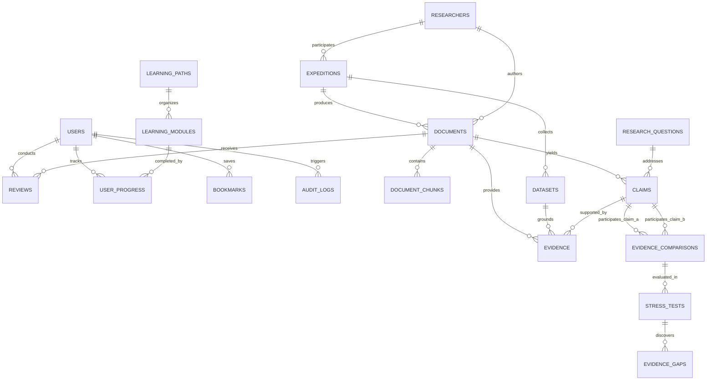

# POLARIS-Ω: System Architecture & Scientific Blueprint

**Polar Research Intelligence & Scientific Evidence System**
*Ministry of Earth Sciences (MoES) | National Centre for Polar and Ocean Research (NCPOR)*
*Problem Statement: SIH26063*

---

## A. Complete System Architecture

```mermaid
flowchart TB
    subgraph ClientLayer ["Client Presentation Layer (Next.js 15 App Router / TypeScript)"]
        UI_Home["/ Home & Discovery"]
        UI_Repo["/repository & /documents"]
        UI_Evidence["/claims & /evidence & /lineage"]
        UI_Compare["/comparisons & /stress-test"]
        UI_Temporal["/timeline & /research-questions"]
        UI_Map["/map Polar Explorer (MapLibre)"]
        UI_Learn["/learning Polar Hub"]
        UI_Admin["/admin & /analytics & /audit"]
    end

    subgraph APILayer ["FastAPI REST Gateway & RBAC Layer"]
        AuthModule["Auth & JWT / RBAC Engine"]
        DocModule["Document & Dataset Ingestion API"]
        SearchModule["Universal Hybrid Search Engine"]
        EvidenceModule["Evidence & Claim Intelligence API"]
        StressTestModule["Evidence Stress-Test Engine"]
        TemporalModule["Temporal Analysis & Lineage Engine"]
        LearningModule["Learning Hub & Progress Tracking"]
        AdminModule["Audit, Health & Security API"]
    end

    subgraph ProcessingLayer ["Document Intelligence & AI Pipeline (Async Workers)"]
        WorkerPool["Background Ingestion Worker Pool"]
        PDFProcessor["Text & Table Extractor + PyPDF/OCR"]
        MetadataExtractor["Scientific Metadata & NER Extractor"]
        EmbeddingEngine["Semantic Embedding Engine (Vector Cache/Model)"]
        ClaimExtractor["Source-Grounded Claim Extractor"]
        ComparisonEngine["Multi-Variable Contextual Comparator"]
        StressEngine["Sensitivity & Gap Identification Heuristic Engine"]
        PhotoForensics["Image SHA-256 & EXIF Forensic Validator"]
    end

    subgraph PersistenceLayer ["Persistence & Storage Layer"]
        SQLDB[("PostgreSQL / SQLite Database\n(SQLAlchemy 2.0 Async ORM)")]
        VectorStore[("pgvector / High-Dimensional Vector Index")]
        FileStorage[("Document & Dataset Object Storage\n(Encrypted Hash-Indexed Local/S3)")]
        AuditLogStore[("W3C PROV Compliant Audit Trail")]
    end

    ClientLayer -->|HTTPS / JSON / JWT| APILayer
    APILayer --> ProcessingLayer
    APILayer --> PersistenceLayer
    ProcessingLayer --> PersistenceLayer
```

---

## B. Feature Hierarchy

1. **Scientific Evidence Core**
   - **Repository & Artifact Storage:** Research reports, publications, expeditions, datasets, media, raw files with cryptographic SHA-256 verification and source classification (`OFFICIAL`, `OPEN_ACCESS`, `USER_UPLOADED`, `EXTERNAL_REFERENCE`, `SYNTHETIC_TEST`).
   - **Grounded Claim Extraction:** Extraction of claims with explicit sentence-level text anchors, source pages, confidence metrics, and verification states.
   - **Evidence Objects:** High-cardinality metadata including geographic coordinates, temporal windows, sampling methodology, instruments, measurements, and sample size.
2. **Signature Analytical Engines**
   - **Evidence Comparison Engine:** Analyzes potential evidence disagreements across temporal, spatial, methodological, and instrument axes without making authoritarian declarations.
   - **⭐ Evidence Stress-Test & Gap Resolver (Signature Feature):** Evaluates which contextual dimension (Location, Time Period, Season, Method, Instrument) has the highest sensitivity impact on claim compatibility. Identifies missing evidentiary links and surfaces matching NCPOR/MoES datasets to close the gap.
   - **Methodological Compatibility Matrix:** Transparent POLARIS Heuristic scoring with inspectable weighting and zero black-box assertions.
   - **Evidence Freshness Tracker:** Quantifies recent supporting/challenging evidence, newer studies, and reassessment triggers.
3. **Temporal & Spatial Discovery**
   - **Temporal Research Explorer:** Interactive multi-decade research evolution timeline mapping polar questions to shifting evidentiary landscapes.
   - **Research Question Tracker:** Tracks living scientific questions and their lineage.
   - **Polar Expedition & Station Map:** High-precision polar map (Arctic, Antarctic, Himalayas) linking field stations (Maitri, Bharati, Himadri, IndARC, Dakshin Gangotri) to datasets and papers.
   - **Research Rediscovery Engine:** Identifies high-relevance historic research using multidimensional signals (semantic relevance, methodology, topic revival).
4. **Pedagogy, Outreach & Governance**
   - **Polar Learning Hub:** Multi-tier structured curriculum (Beginner to Research) grounded strictly in verified primary literature with progress tracking.
   - **Human-in-the-Loop Review System:** Reviewer dashboard to approve, reject, edit, or flag AI-extracted claims with complete audit history.
   - **Outreach Draft Generator:** Generates educational summaries and press releases clearly marked as AI-generated with source citations.
   - **Enterprise Security & Audit:** Role-Based Access Control (RBAC), cryptographically signed file provenance, rate-limiting, and sanitized query execution.

---

## C. Database ER Design

---

## D. API Architecture

- `POST /api/v1/auth/register` & `POST /api/v1/auth/login` (JWT with RBAC)
- `GET /api/v1/documents` & `POST /api/v1/documents` (Multipart upload with SHA-256 hashing)
- `GET /api/v1/documents/{id}/process` (Trigger asynchronous AI document intelligence)
- `GET /api/v1/search/universal` (Hybrid keyword + semantic vector retrieval)
- `GET /api/v1/claims` & `GET /api/v1/evidence` (Structured scientific evidence querying)
- `POST /api/v1/comparisons` (Multi-variable claim comparison)
- `POST /api/v1/stress-test` (Sensitivity analysis & repository gap discovery)
- `GET /api/v1/temporal/timeline` (Decadal evidence evolution query)
- `GET /api/v1/research-questions` (Living scientific question tracker)
- `GET /api/v1/rediscovery` (Historic paper surfacing engine)
- `GET /api/v1/expeditions` & `GET /api/v1/map/layers` (Polar stations & geographic indices)
- `GET /api/v1/learning/paths` & `POST /api/v1/learning/progress` (Pedagogical hub)
- `GET /api/v1/admin/analytics` & `GET /api/v1/admin/audit-logs` (Administrative oversight)
- `POST /api/v1/evaluations/run` (Quantitative AI benchmark evaluation)

---

## E. Frontend Route Structure & Design System

### Aesthetic & Color Palette (Unique, Realistic Scientific Palette - NO BLUE):
- **Background Base:** Deep Carbon Slate (`#12161A`, `#181E24`, `#1F2730`)
- **Card & Surface Layers:** Brushed Titanium Slate (`#252E38`, `#2E3A46`) with subtle borders (`#3A4856`)
- **Primary Scientific Accent:** Auroral Frost Emerald (`#10B981`, `#059669`, `#34D399`)
- **Secondary Alert / Contextual Accent:** Polar Ochre & Amber (`#D97706`, `#F59E0B`)
- **Text Hierarchy:** High-contrast Frost White (`#F1F5F9`), Cool Silver (`#94A3B8`), Muted Slate (`#64748B`)
- **Typography:** Outfit / Inter / JetBrains Mono for scientific measurements.

### App Routes:
- `/` - Strategic Scientific Discovery Hub
- `/repository` - Search & Scientific Faceted Repository
- `/documents/[id]` - Document Evidence Inspector & PDF Grounding View
- `/claims` - Claim & Evidence Explorer
- `/comparisons` - Multi-Variable Disagreement Analyzer
- `/stress-test` - Signature Contextual Sensitivity & Evidence Gap Engine
- `/timeline` - Temporal Research & Evidence Evolution Explorer
- `/research-questions` - Polar Research Question Tracker
- `/rediscovery` - Historic Research Rediscovery Engine
- `/map` - Polar Expedition & Research Station Explorer
- `/learning` - Polar Learning Hub
- `/datasets` & `/expeditions` - MoES / NCPOR Expeditions (Dakshin Gangotri, Maitri, Bharati, Himadri)
- `/researchers` - Verified Scientist Profiles
- `/admin` - System Health, Evaluation Benchmarks, Moderation & Audit Logs
- `/login` & `/register` - Secure Authentication

---

## F. AI & Document Intelligence Pipeline

1. **File Ingestion:** PDF/CSV validation, MIME verification, SHA-256 cryptographic hash computation.
2. **Text & Layout Parsing:** Section header detection (Abstract, Methodology, Findings, Data Availability), table extraction.
3. **Structured Entity & Claim Extraction:** Rule-assisted and model-guided extraction of claims with bounded context, spatial coordinates, time spans, instrument, and confidence scores.
4. **Vector Embedding:** High-dimensional dense representations for claims, abstracts, and sections.
5. **Comparison & Stress Engine:** Algorithmic calculation of contextual distance across location, period, season, method, and instrument to determine potential disagreement likelihood and gap identification.
6. **Quantitative Benchmarking:** Built-in evaluation test harness computing Precision, Recall, F1, and Precision@K on golden polar test cases.

---

## G. Security & Provenance Model

- **Authentication:** Stateless Bearer JWT with Argon2id / bcrypt password hashing.
- **Role-Based Access Control:** Strict permission matrix (`PUBLIC`, `STUDENT`, `RESEARCHER`, `REVIEWER`, `ADMIN`).
- **File Provenance:** SHA-256 checksums, EXIF metadata extraction for field media, W3C PROV-compatible audit logging.
- **Defense in Depth:** Input sanitization, parameterized queries, rate limiting, and explicit CORS control.

---

## H. Deployment Architecture

- **Containerization:** Production Docker Compose stack (`frontend`, `backend`, `worker`, `db`, `redis`).
- **Scalable Services:** Decoupled asynchronous worker queue for long-running document processing.
- **Environment Isolation:** Zero hardcoded credentials via comprehensive `.env` configuration.

---

## I. Testing & Quantitative Evaluation Strategy

- **Backend Pytest Suite:** Testing auth, RBAC permissions, document processing, claim extraction, comparison heuristics, stress-test calculations, and security boundaries.
- **Frontend Quality Assurance:** Component rendering, state consistency, responsive layouts, and visual error states.
- **Quantitative ML Benchmarking:** Automated evaluation metrics reporting real F1, Precision, and Recall on polar evidence verification sets.
